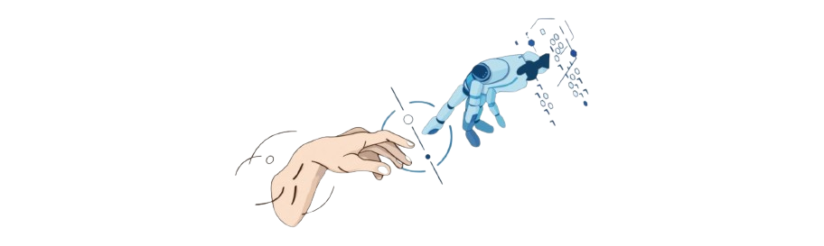

  

## 📈 GitHub Stats

## 📫 Connect with Me

<!-- Technologies & Tools -->
## 🔧 Technologies & Tools

<!-- Currently Learning -->

## 🌱 Current Overview

Improving my skills in NextJs.
Passionate about crafting web experiences and solving real-world problems. I'm currently learning Next.js and and I specialize in the MERN stack, bringing ideas to life through clean and efficient code.

Feel free to explore my repositories and connect with me! 😊
